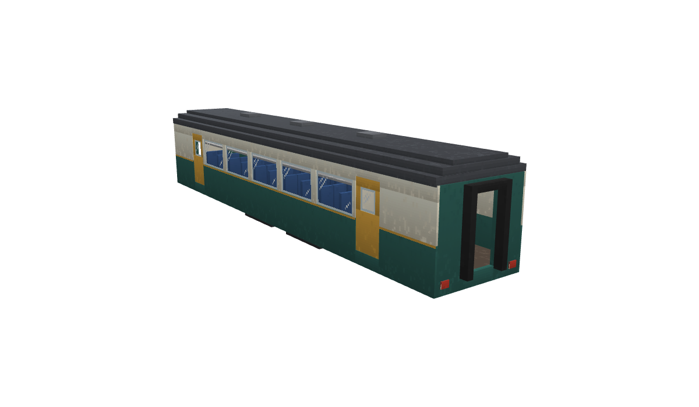
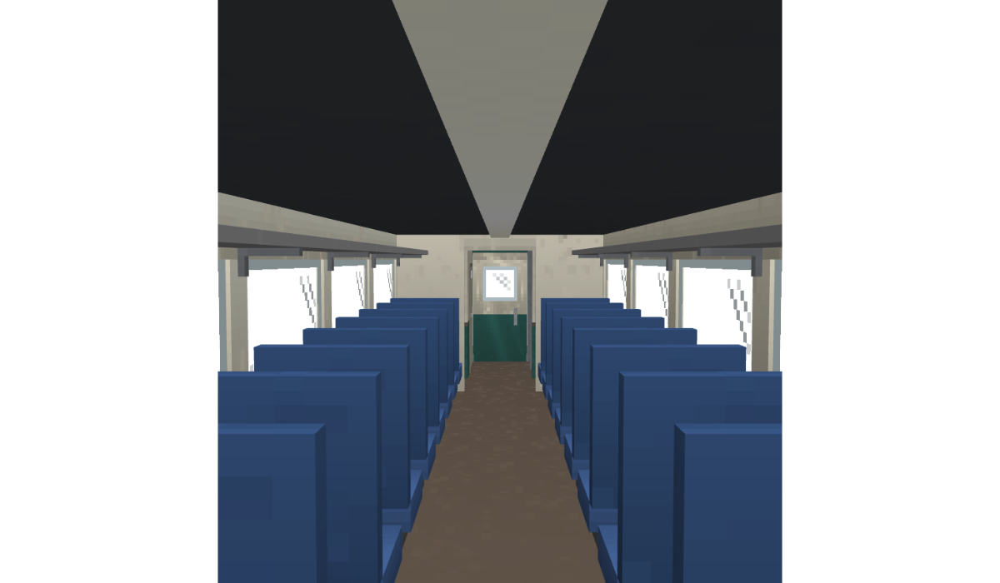

<div align="center">



# Create: Railbound

**Ready-made trains for [Create](https://github.com/Creators-of-Create/Create).**<br>
One item. One click. A real Create train — with walkable interiors, seats, doors and cargo.

<br>

[](https://www.minecraft.net)
[](https://neoforged.net)
[](https://github.com/Creators-of-Create/Create)
[](#roadmap)
[](LICENSE.md)

[Features](#features) &nbsp;·&nbsp; [How it works](#how-it-works) &nbsp;·&nbsp; [Roadmap](#roadmap) &nbsp;·&nbsp; [Custom trainsets](#make-your-own-trainsets) &nbsp;·&nbsp; [Building](#building-from-source) &nbsp;·&nbsp; [License](#license)

</div>

<br>

> [!IMPORTANT]
> **Railbound is in early development.** Version 0.1 lays the foundation: trainset designs load from datapacks, are validated, sync to every player, and appear as items in their own creative tab. **Trains cannot be placed yet** — that arrives with the next milestone. Follow the [roadmap](#roadmap) for progress.

<br>

## Features

Building a good-looking train in Create takes hours of block-by-block work. Railbound gives you complete, detailed rolling stock in a single item — and it is still a genuine Create train underneath, so schedules, stations and signals work exactly as you expect.

<sub>Everything below is the 1.0 goal. See the <a href="#roadmap">roadmap</a> for what is already done.</sub>

| | |
|---|---|
| **Single-item trainsets** | Every locomotive and carriage is one item rendering a full, detailed model — no block-by-block building. |
| **Real Create trains** | Placed with Create's own station assembly. Schedules, signals, stations and other train addons see an ordinary Create train. |
| **Walkable interiors** | Step inside, walk the aisle and right-click a seat to sit. Passenger cars seat four abreast — two each side of a centre aisle. |
| **Doors that work** | Doors open automatically when the train stops at a station, using Create's train-door behaviour. |
| **Freight that works** | The items carriage holds 160 stacks and the fluid carriage 144 buckets. Open them by hand, or load and unload through Create's Portable Storage and Portable Fluid Interfaces. |
| **Mix and match** | Couple trainset cars with your own hand-built carriages in the same train. |
| **Data-driven** | Every design is a datapack + resource pack. Modpacks can add their own trains without writing code. |

<div align="center">
<br>
<sub><i>Inside the Standard Passenger Coach — 40 seats in a 2 + 2 layout. Prototype model.</i></sub>
</div>

### Planned rolling stock

| Phase | Locomotives | Carriages |
|:---:|---|---|
| 1 | Steam | Passenger coach · Items carriage · Fluid carriage |
| 2 | — | More carriage types |
| 3 | 2 × Diesel | Passenger and goods multiple units |
| 4 | 2 × Electric | 2 carriages per type · 2 EMUs |

<br>

## How it works

Railbound plugs into the train assembly you already know from Create:

1. **Build a station** beside straight track and switch it to **assembly mode**.
2. **Right-click the track** with a trainset item — the carriage appears, already on its bogeys.
3. Add more cars (sneak-click to place one facing backwards, for the rear cab of a multiple unit).
4. Press **Assemble Train**. Drive it yourself, or seat a conductor at the controls and hand them a schedule — it is a Create train.
5. Back at a station, disassemble and **shift + right-click with a wrench** to pick a carriage up again.

Under the hood, each carriage is a set of invisible structural blocks — floor, walls, seats, doors and cargo — topped by a single model. Create assembles and runs it like any other train, which is why everything stays compatible.

<br>

## Roadmap

Railbound ships in four phases. Each phase is built in small sub-phases, and every sub-phase is finished, tested and reviewed before the next one begins.

| Phase | Theme | What arrives |
|:---:|---|---|
| **1** | **First version** | Steam locomotive, passenger coach, items carriage, fluid carriage — fully working with Create's navigation and schedules |
| **2** | **More carriages & crafting** | New carriage types, crafting recipes with dedicated components, Ponder scenes, bogeys, couplers and anti-climbers |
| **3** | **Fuel trains** | Diesel locomotives burning coal, wood or fuels from other mods, plus passenger and goods multiple units |
| **4** | **Electric trains** | Catenary poles, wires and a power generator — compatible with Create: Power Grid and Create: New Age — plus electric locomotives, carriages and EMUs |

### Phase 1 progress

| | Sub-phase | Delivers |
|:---:|---|---|
| ✅ | **1.0 Foundation** | Design format, validation, datapack loading, multiplayer sync, trainset item and creative tab |
| ⏳ | **1.1 Coach on rails** | Placing a carriage on track and assembling it into a real Create train |
| ○ | **1.2 Coach interior** | Right-click seating and doors that open at stations |
| ○ | **1.3 Coach visuals** | Full 3D models in game, animated doors, Blockbench-to-game converter |
| ○ | **1.4 Steam locomotive** | Driver's cab, conductor seat and automatic running on schedules |
| ○ | **1.5 Items carriage** | 160-stack storage, scrolling GUI, Portable Storage Interface |
| ○ | **1.6 Fluid carriage** | 144-bucket tank, fill-and-drain GUI, Portable Fluid Interface |
| ○ | **1.7 Release** | Compatibility, performance and polish |

<br>

## Make your own trainsets

Designs are plain JSON in a datapack, so anyone can add trains:

```
data/<namespace>/railbound/trainsets/<id>.json
```

```jsonc
{
  "name": "trainset.mypack.observation_car",   // translation key
  "category": "passenger",                    // passenger · box_car · tank_car · locomotive · multiple_unit
  "size": { "length": 16, "width": 3, "height": 3 },
  "bogeys": [ { "z": 3 }, { "z": 12 } ],      // always exactly two
  "power": "none",
  "layout": {
    "palette": { "#": "frame:floor", "S": "seat", "D": "door", "A": "anchor", ".": "air" },
    "layers": [ /* one text row per block along the carriage, one layer per height */ ]
  }
}
```

Broken designs never crash the game — they are skipped with a log line that names the file and the exact problem, and every other design still loads. The full format is documented in the [design specification](docs/superpowers/specs/2026-10-02-trainsets-design.md#7-design-data-format). A complete working example ships with the mod: [`coach_standard.json`](Mod/src/main/resources/data/railbound/railbound/trainsets/coach_standard.json).

<br>

## Compatibility

| Requirement | Version |
|---|---|
| Minecraft | 1.21.1 |
| NeoForge | 21.1.219 or newer |
| Create | 6.0.10 – 6.0.x |

Tested loading alongside a 129-mod Create pack, including Create: Steam 'n' Rails (NeoForge port), Create: New Age, Create: Power Grid and Create Railways Navigator.

<br>

## Building from source

You need **JDK 21**.

```bash
git clone https://github.com/DharshanTeja/Create-Railbound.git
cd Create-Railbound/Mod

./gradlew build        # compile, run the test suite, build the jar
./gradlew runClient    # launch a development client with Create
./gradlew runServer    # launch a development dedicated server
```

The jar is written to `Mod/build/libs/`.

<details>
<summary><b>Project layout</b></summary>

```
Create-Railbound/
├── Mod/                    the NeoForge mod (Gradle project)
│   └── src/
│       ├── main/java/dev/railbound/
│       │   ├── trainset/design/   design records, layout parser, validator
│       │   ├── trainset/load/     datapack loading and the live design registry
│       │   ├── trainset/item/     the trainset item, names and tooltips
│       │   ├── network/           design sync to clients
│       │   └── registry/          items, data components, creative tab
│       └── test/                  unit tests
├── art/                    Blockbench source models and preview renders
└── docs/                   design specification and implementation plans
```

</details>

<br>

## Contributing

Issues and ideas are welcome. Before opening a pull request, please read the [design specification](docs/superpowers/specs/2026-10-02-trainsets-design.md) — it explains how carriages are built and why — and make sure `./gradlew build` passes.

<br>

## License

| | License |
|---|---|
| **Code** | [MIT](LICENSE.md#2-code--mit-license) — use, fork and build on it freely |
| **Art & assets** — models, textures, renders | [All Rights Reserved](LICENSE.md#1-art--assets--all-rights-reserved) |

This mirrors the licensing of Create itself. Modpacks are always welcome to include the official release. See [LICENSE.md](LICENSE.md) for the full terms.

<br>

## Acknowledgements

- **[Create](https://github.com/Creators-of-Create/Create)** by simibubi and the Creators of Create — the foundation everything here runs on.
- **[Minecraft Transit Railway](https://github.com/Minecraft-Transit-Railway/Minecraft-Transit-Railway)** — inspiration for single-item, model-based trains.
- **[Create: Steam 'n' Rails](https://github.com/Layers-of-Railways/Railway)** — for showing how far Create's railways can go.

<br>

<div align="center">
<sub>Create: Railbound is an unofficial addon. It is not affiliated with or endorsed by the Create team or Mojang Studios.</sub>
</div>
